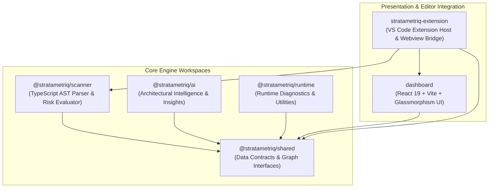

# Monorepo System Design & Architecture

StrataMetriq is architected as a clean, decoupled monorepo workspace structured into specialized engine and presentation layers.

---

## 📊 High-Level System Architecture

---

## 🛠️ Workspace Module Breakdown

### 1. `@stratametriq/shared`
The foundational data contract layer. Defines core TypeScript interfaces (`Node`, `Edge`, `Graph`, `DuplicatePair`, `ProductionRisk`) ensuring type safety between the backend AST parser and the frontend React UI.

### 2. `@stratametriq/scanner`
The heavy-lifting AST engine powered by Microsoft's `typescript` compiler API. It scans `.ts`, `.tsx`, `.js`, and `.jsx` files, extracts imports/exports, maps Express/HTTP router endpoints, evaluates syntax errors, and runs lexical tokenization for duplicate detection.

### 3. `@stratametriq/ai`
Provides intelligent heuristic evaluations and architectural recommendations.

### 4. `@stratametriq/runtime`
Helper utilities for evaluating runtime execution traces and environment configurations.

### 5. `dashboard`
A responsive, high-performance webview built with **React 19**, **Vite 8**, and **@xyflow/react**. It renders dynamic visual trees, glassmorphic inspection cards, and real-time filtering pills. Built as a single-file inline bundle for seamless VS Code embedding.

### 6. `stratametriq-extension`
The host wrapper that registers VS Code commands (`stratametriq.start`), manages the webview lifecycle, handles bi-directional message passing, and triggers editor tab synchronization.
