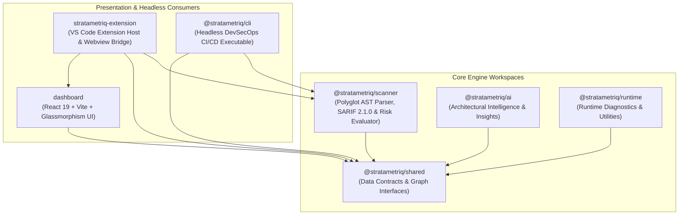

# Monorepo System Design & Architecture

StrataMetriq is architected as a clean, decoupled monorepo workspace structured into specialized engine and presentation layers.

---

## 📊 High-Level System Architecture

---

## 🛠️ Workspace Module Breakdown

### 1. `@stratametriq/shared`
The foundational data contract layer. Defines core TypeScript interfaces (`Node`, `Edge`, `Graph`, `DuplicatePair`, `ProductionRisk`) ensuring type safety between the backend AST parser, the headless CLI, and the frontend React UI.

### 2. `@stratametriq/scanner`
The heavy-lifting AST and framework analysis engine:
* **Polyglot AST & Framework Parser**: Scans JavaScript/TypeScript (`.js`, `.ts`, `.jsx`, `.tsx`), Python (`.py` — FastAPI/Django), Java/Kotlin (`.java`, `.kt` — Spring Boot), C# (`.cs` — ASP.NET Core), and Go (`.go` — Gin/Echo).
* **DevSecOps Risk Auditor**: Evaluates 13 pre-deployment safety categories (hardcoded secrets, SQL injection, insecure crypto, debug statements, empty catch blocks, commented code).
* **SARIF 2.1.0 Report Generator (`sarif.ts`)**: Exports OASIS SARIF v2.1.0 compliant JSON reports for GitHub Advanced Security and GitLab Security integration.

### 3. `@stratametriq/cli`
The standalone headless DevSecOps CLI (`stratametriq scan .`). Executes architecture audits in CI/CD pipelines, enforces quality gates (`--fail-on-high`, `--fail-on-circular`), and exports Markdown PR comments (`--md`), SARIF files (`--sarif`), and interactive HTML reports (`--html`).

### 4. `@stratametriq/ai`
Provides intelligent heuristic evaluations and architectural recommendations.

### 5. `@stratametriq/runtime`
Helper utilities for evaluating runtime execution traces and environment configurations.

### 6. `dashboard`
A responsive, high-performance webview built with **React 19**, **Vite 8**, and **@xyflow/react**. It renders dynamic visual trees, glassmorphic inspection cards, and real-time filtering pills. Built as a single-file inline bundle for seamless VS Code embedding.

### 7. `stratametriq-extension`
The host wrapper that registers VS Code commands (`stratametriq.start`), manages the webview lifecycle, handles bi-directional message passing, and triggers editor tab synchronization.
